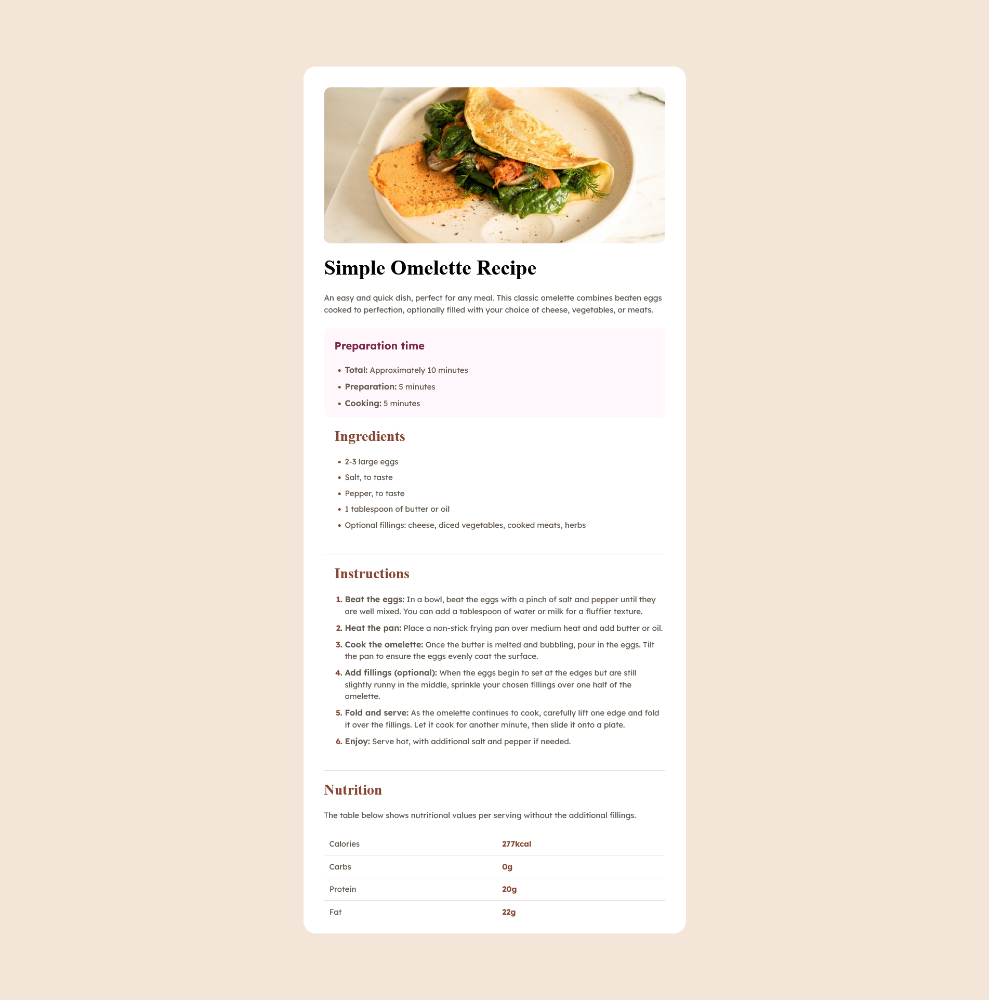

# Frontend Mentor - Recipe page solution

This is a solution to the [Recipe page challenge on Frontend Mentor](https://www.frontendmentor.io/challenges/recipe-page-KiTsR8QQKm). Frontend Mentor challenges help you improve your coding skills by building realistic projects. 

## Table of contents

- [Overview](#overview)
  - [The challenge](#the-challenge)
  - [Screenshot](#screenshot)
  - [Links](#links)
- [My process](#my-process)
  - [Built with](#built-with)
  - [What I learned](#what-i-learned)
  - [Continued development](#continued-development)
  - [Useful resources](#useful-resources)
- [Author](#author)

## Overview
A challenge to use HTML and CSS to build a prototype of a recipe 
### Screenshot

### Links

- Live Site URL: [https://maame-codes.github.io/Recipe-page/]()

## My process

First of all, I drew down the outline of the page, hence I started with the HTML of the page. When I was done, I then went ahead to add the styling; the font sizes, colors etc. Then I added the various div's to group them, to make individual styling easier for me. With the help of figma, I was able to get the correct padding and margins for the various divs in the code. Whenever I was lost, I used w3schools mainly for documentation.

### Built with

- Semantic HTML5 markup
- CSS custom properties
- Flexbox
- [figma](https://www.figma.com/) - Figma

### What I learned
The most important thing I learnt from this particular project was how to use flexbox to center the entire page, and also looking into the small details.

### Continued development

Learn more about using css flex and grid

### Useful resources

- [w3schools](https://www.w3schools.com/) - This helped me a lot with documentation and helped me to refresh my memory on the basic stuff I had forgotten.
- [Figma](https://figma.com/) - This helped me with getting the correct sizes of div's and colors. Made it really easy for me to finish my projects, instead of guessing the sizes.

## Author

- Frontend Mentor - [@Maame-codes](https://www.frontendmentor.io/profile/Maame-codes)
